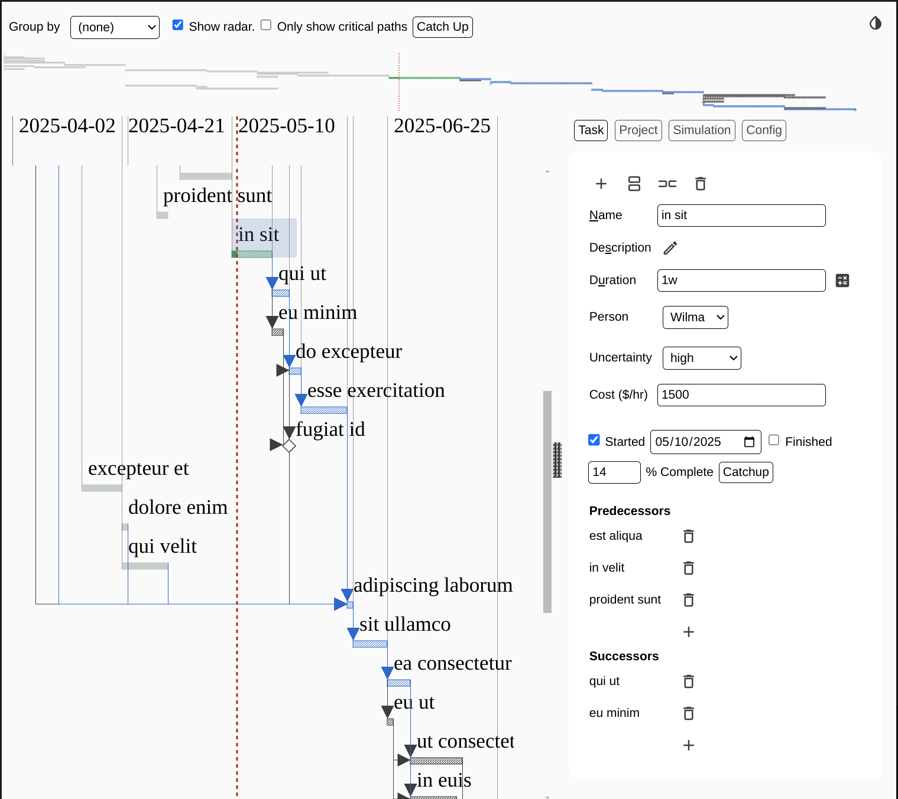

# Explan

Create and edit Gantt charts directly in VS Code.

To start create an empty file with an extension of `.explan`, `.explan.json`, or
`.explan.png` and open it in Visual Studio Code.

Or run the `Explan: Create new Explan Document` action.

Press `Shift-Ctrl-H` to display all the keyboard shortcuts.

## Features

* Plans can be stored in either JSON format (`*.explan` or `*.explan.json`) or as PNG files (`*.explan.png`).
* Regardless of the format the charts can always be reopened and edited.
* Add your own resource and metric definitions.
* Durations are entered in human-centric notation, e.g. `2w3d` is two weeks and 3 days.
* Easily split or duplicate tasks.
* Fast Fuzzy search to jumpt to task `Ctrl-F` or `Shift-Ctrl-F`.
* Radar allows quick zooming into parts of the chart.
* Double-click on a task in the chart to zoom into that task, showing only its predecessors and successors.
* Simulate possible project timelines based on the Uncertainty set for each task, allowing the discovery of hidden critical paths.
* Group tasks by resource, for example to show what each person is working on.

### Darkmode

Supports both dark mode and light mode:

## Requirements

None.

## Release Notes

### 0.0.1

Initial release.
